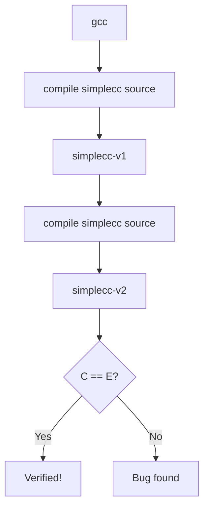

# Lesson 0075: Bootstrap and Verification

## Status: 📋 Planned | Phase: Self-Hosting | Effort: Hard

## Objective

Prove the compiler is correct via bootstrap verification.

## Bootstrap Process

## Implementation Checklist

- [ ] Build simplecc-v1 using gcc
- [ ] Build simplecc-v2 using simplecc-v1
- [ ] Compare outputs (should be identical or equivalent)
- [ ] Run full test suite on both
- [ ] Document verification results
- [ ] Celebration!

## Implementation Details

| Component | Source File | Line(s) | Description |
|-----------|------------|---------|-------------|
| Compiler class | `src/compiler.h` | 18-31 | Core `Compiler` interface — the primary unit to verify across bootstrap builds |
| Compile pipeline | `src/compiler.cpp` | 10-46 | `compile()` — tokenize → parse → codegen; must produce identical output across bootstrap iterations |
| File I/O | `src/compiler.cpp` | 48-60 | `compile_file()` — reads `.c` files from disk |
| CLI entry point | `src/main.cpp` | 17-85 | `main()` — the executable entry point; binary output must be functionally equivalent across builds |
| Lexer | `src/lexer.cpp` | 1-452 | Complete tokenizer — must produce identical token streams from identical input |
| Parser | `src/parser.cpp` | 1-1267 | Complete parser — must produce equivalent ASTs from identical token streams |
| Code generator | `src/codegen.cpp` | 1-1232 | Complete codegen — must produce equivalent assembly from identical ASTs |
| Token definitions | `src/token.h` | 9-115 | Token types and struct — shared interface between lexer and parser |
| AST definitions | `src/ast.h` | 1-539 | AST node types — shared interface between parser and codegen |
