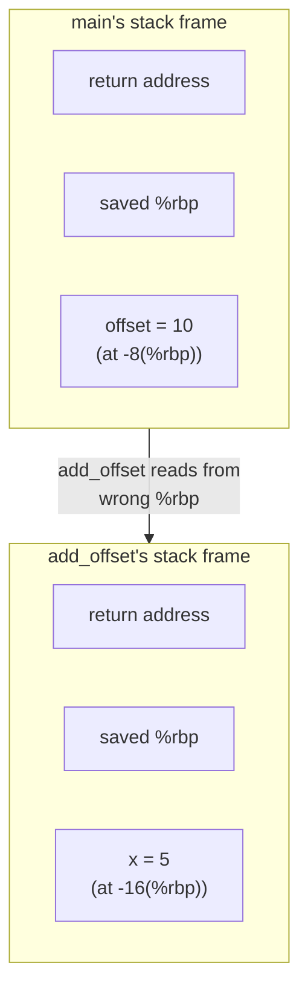
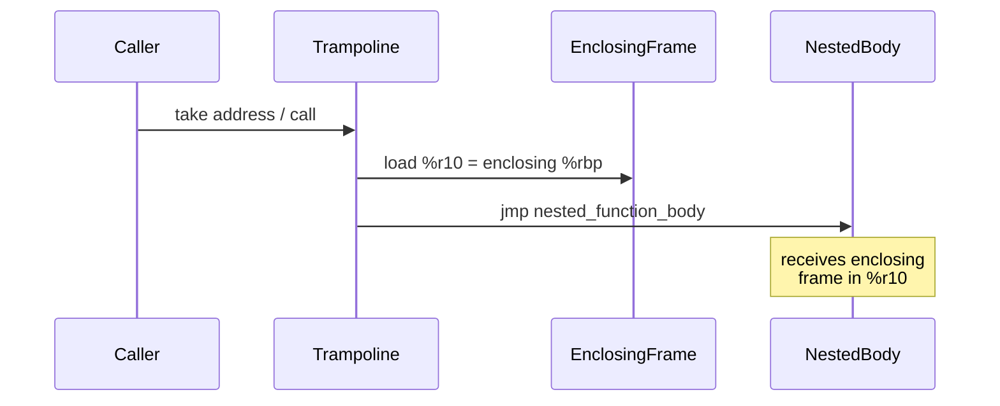

# Lesson 0086: Nested Functions (GCC Extension)

## Status: ✅ Complete | Phase: GCC Extensions | Tests: Basic

## Objective

Support GCC-style nested functions — functions defined inside other functions
that can access the enclosing scope's local variables. The implementation uses
a **hidden context pointer** ABI: the nested function receives a pointer to a
copy of the enclosing function's captured locals as its first argument.

## Example

```c
int main() {
    int offset = 10;
    int add_offset(int x) {
        return x + offset;  // captures 'offset' from enclosing scope
    }
    return add_offset(5);   // returns 15
}
```

Run it end-to-end:

```bash
./build/simplecc -S 0086-nested-functions/src/example.c -o /tmp/example.s
gcc -o /tmp/example /tmp/example.s
/tmp/example ; echo "exit: $?"       # → exit: 15
```

## Implementation Status

### What Works

| Feature | Status | Notes |
|---------|--------|-------|
| Function declaration inside block | ✅ | Parser detects `type name(...)` inside `{}` via `function_stack_` |
| Nested function body parsing | ✅ | Recursive `parse_block()` handles nested blocks |
| Separate function generation | ✅ | Body deferred; emitted as a top-level label after the enclosing function's epilogue |
| Simple calls (no capture) | ✅ | `int f(int x) { return x; }` inside `main` works |
| Variable capture from enclosing scope | ✅ | Hidden context pointer in `%rdi`, copied to a stack slot, read with width-aware `mov` |

### What Doesn't Work

| Feature | Status | Notes |
|---------|--------|-------|
| Trampoline generation | ❌ | GCC's stack-executable trampolines; would need `mprotect` |
| Multiple nesting levels | ❌ | Only one level of nesting is supported |
| Nested function pointers | ❌ | Can't pass a nested function as a callback |
| `auto` nested functions | ❌ | GCC's `auto int f(...) { ... }` keyword form |

## Why Nested Functions Are Hard

### The Problem

When `add_offset` is called, it needs access to `offset` which lives on
`main`'s stack frame. But `add_offset` is a separate function — it doesn't
have a reference to `main`'s frame.



### GCC's Solution: Trampolines

GCC implements nested functions using **trampolines** — small executable
code blocks allocated on the stack:



### Why We Don't Implement Trampolines

1. **NX bit / W^X** — modern OSes forbid executing code on the stack
2. **Complexity** — would need `mprotect()` or `mmap()` with `PROT_READ|PROT_WRITE|PROT_EXEC`
3. **Not standard C** — rarely used in practice
4. **Simpler alternatives** — `void*` context parameters (what we use) or C++11 lambdas

## Our Approach: Hidden Context Pointer

When the parser sees a function definition inside another function's body
(`function_stack_` is non-empty), it sets `FunctionDeclNode::is_nested = true`
and remembers the parent function name. The codegen then *defers* the body
emission and produces a top-level `add_offset:` label after the enclosing
function's epilogue.

### Parser: Mark Nested Functions

```cpp
// src/parser.cpp:578-615 (Parser::parse_function_decl)
ASTPtr Parser::parse_function_decl(const std::string& type_name) {
    const Token& name_token = tokens_[pos_ - 1];
    auto func = std::make_unique<FunctionDeclNode>(
        type_name, name_token.value, name_token.line, name_token.column);

    // A function is nested if we are currently inside another function's body.
    bool is_nested = !function_stack_.empty();
    func->is_nested = is_nested;
    if (is_nested) {
        func->parent_function = function_stack_.back();
    }

    expect(TokenType::LPAREN);

    if (!check(TokenType::RPAREN)) {
        do {
            auto param = parse_param();
            if (param) func->params.push_back(std::move(param));
        } while (match(TokenType::COMMA));
    }
    expect(TokenType::RPAREN);

    // Forward declaration: no body
    if (check(TokenType::SEMICOLON)) {
        advance();
        func->body = nullptr;
    } else {
        function_stack_.push_back(func->name);
        func->body = parse_block();
        function_stack_.pop_back();
    }

    return std::move(func);
}
```

The `function_stack_` (declared in `src/parser.h:97`) is pushed when entering
a function body and popped on exit, so any `type name(...)` token sequence
seen while the stack is non-empty is by definition nested.

### Codegen: Defer Body Emission, Then Emit as a Top-Level Function

The `CodeGenerator` keeps a queue `pending_nested_functions_` of nested
function definitions encountered while emitting the enclosing function's
body. The enclosing function's visitor does **not** recurse into the nested
body — that would execute the nested code as part of the enclosing function.
Instead, it snapshots the enclosing locals, records the nested function in
`nested_func_info_`, and pushes a `PendingNestedFunc` entry. After the
enclosing function's epilogue, the deferred entries are emitted one by one
via `emit_pending_nested_function`:

```cpp
// src/codegen.cpp:305-373 (visit(FunctionDeclNode), nested branch)
if (node.is_nested) {
    // Snapshot the enclosing function's state.  The enclosing
    // function's local_variables_ is the candidate set for capture.
    auto saved_locals = local_variables_;
    auto saved_types = variable_types_;
    auto saved_arrays = array_info_;
    auto saved_captures = current_captures_;
    int saved_ctx_stack_offset = current_ctx_stack_offset_;

    // Compute the capture set: every local variable of the enclosing
    // function that exists at this point.
    std::vector<FunctionDeclNode::CapturedVar> captures;
    int ctx_off = 0;
    for (const auto& kv : saved_locals) {
        FunctionDeclNode::CapturedVar c;
        c.name = kv.first;
        c.parent_offset = kv.second;
        auto tit = saved_types.find(kv.first);
        c.type = (tit != saved_types.end()) ? tit->second : "int";
        c.size = get_type_size(c.type);
        c.ctx_offset = ctx_off;
        captures.push_back(c);
        ctx_off += 8;  // 8 bytes per slot
    }
    node.captured_vars = captures;

    int ctx_size = captures.size() * 8;
    if (ctx_size < 16) ctx_size = 16;
    ctx_size = ((ctx_size + 15) / 16) * 16;

    NestedFuncInfo info;
    info.captures = captures;
    info.ctx_size = ctx_size;
    nested_func_info_[node.name] = info;

    // Defer the body emission.
    PendingNestedFunc pnf;
    pnf.node = &node;
    pnf.captures = captures;
    pnf.ctx_size = ctx_size;
    pending_nested_functions_.push_back(pnf);

    // Restore enclosing function's state (no codegen output here)
    local_variables_ = saved_locals;
    variable_types_ = saved_types;
    array_info_ = saved_arrays;
    current_captures_ = saved_captures;
    current_ctx_stack_offset_ = saved_ctx_stack_offset;
    return;
}
```

And the trigger that drains the queue, in the same visitor (top-level
function exit path):

```cpp
// src/codegen.cpp:448-456 (visit(FunctionDeclNode), drain pending)
auto saved_pending = pending_nested_functions_;
pending_nested_functions_.clear();
for (auto& pnf : saved_pending) {
    emit_pending_nested_function(pnf);
}
```

### Emitting the Nested Function

`emit_pending_nested_function` runs in a fresh state (empty
`local_variables_`, freshly-initialized `stack_offset_`, the captured set
copied into `current_captures_`). It manually emits a prologue because we
need to stash the hidden `__ctx` parameter that the ABI places in `%rdi`:

```cpp
// src/codegen.cpp:2212-2275 (emit_pending_nested_function)
void CodeGenerator::emit_pending_nested_function(PendingNestedFunc& pnf) {
    // Save enclosing function's state and set up the nested function's
    // own state.  The nested function has its own local_variables_
    // (initially empty), its own captures, and its own __ctx stack slot.
    ...
    local_variables_.clear();
    variable_types_.clear();
    array_info_.clear();
    current_captures_ = pnf.captures;
    current_ctx_stack_offset_ = 0;
    stack_offset_ = 0;
    returned_ = false;
    current_function_ = pnf.node->name;
    current_function_return_type_ = pnf.node->return_type;

    emit(".globl " + pnf.node->name);
    emit_label(pnf.node->name);
    emit("push %rbp");
    emit("mov %rsp, %rbp");

    int num_user_params = std::min((int)pnf.node->params.size(), 5);
    int total_slots = 1 + num_user_params + local_count + 16;  // +1 for __ctx
    int space = total_slots * 8;
    emit("sub $" + std::to_string(space) + ", %rsp");

    // Save __ctx (first arg, in %rdi) into a stack slot
    stack_offset_ += 8;
    current_ctx_stack_offset_ = -stack_offset_;
    emit("mov %rdi, " + std::to_string(current_ctx_stack_offset_) + "(%rbp)");

    // Map user parameters starting from %rsi (since %rdi is taken by __ctx)
    static const char* user_param_regs[] = {"%rsi", "%rdx", "%rcx", "%r8", "%r9"};
    for (int i = 0; i < num_user_params; i++) {
        stack_offset_ += 8;
        int offset = -stack_offset_;
        std::string pname = static_cast<ParamNode*>(pnf.node->params[i].get())->name;
        local_variables_[pname] = offset;
        variable_types_[pname] = static_cast<ParamNode*>(pnf.node->params[i].get())->type_name;
        emit("mov " + std::string(user_param_regs[i]) + ", " +
             std::to_string(offset) + "(%rbp)");
    }

    if (pnf.node->body) {
        dispatch(pnf.node->body.get());
    }
    ...
}
```

> The PC-relative `call` to a forward-referenced label is resolved by the
> assembler, so the nested function's `add_offset:` label can be emitted
> after the call site without any extra bookkeeping.

### Calling Site: Build the Context Struct on the Stack

The caller allocates `ctx_size` bytes on the stack, fills them with the
current values of the captures, pushes the user arguments in reverse
order, pops them into `%rsi..%r9`, sets `%rdi` to the context struct, and
calls the nested function. The context struct is then deallocated:

```cpp
// src/codegen.cpp:1240-1286 (CallExprNode::visit, nested branch)
auto nit = nested_func_info_.find(node.function_name);
if (nit != nested_func_info_.end()) {
    const NestedFuncInfo& info = nit->second;
    int ctx_size = info.ctx_size;

    // Allocate space for the context struct on the stack.
    emit("sub $" + std::to_string(ctx_size) + ", %rsp");

    // Populate the context struct with current values of the captures.
    for (const auto& cap : info.captures) {
        auto lit = local_variables_.find(cap.name);
        int parent_off = (lit != local_variables_.end()) ? lit->second : cap.parent_offset;
        int sz = cap.size;
        if (sz == 1) emit("movzbl " + std::to_string(parent_off) + "(%rbp), %eax");
        else if (sz == 2) emit("movzwl " + std::to_string(parent_off) + "(%rbp), %eax");
        else if (sz == 4) emit("movl " + std::to_string(parent_off) + "(%rbp), %eax");
        else emit("mov " + std::to_string(parent_off) + "(%rbp), %rax");
        if (sz == 1) emit("mov %al, " + std::to_string(cap.ctx_offset) + "(%rsp)");
        else if (sz == 2) emit("mov %ax, " + std::to_string(cap.ctx_offset) + "(%rsp)");
        else if (sz == 4) emit("movl %eax, " + std::to_string(cap.ctx_offset) + "(%rsp)");
        else emit("mov %rax, " + std::to_string(cap.ctx_offset) + "(%rsp)");
    }

    // Evaluate user arguments and push them onto the stack
    // (right to left) so they sit above the context struct.
    int num_user_args = std::min((int)node.arguments.size(), 5);
    for (int i = num_user_args - 1; i >= 0; i--) {
        dispatch(node.arguments[i].get());
        emit("push %rax");
    }

    // Pop user arguments into %rsi, %rdx, %rcx, %r8, %r9
    static const char* user_param_regs[] = {"%rsi", "%rdx", "%rcx", "%r8", "%r9"};
    for (int i = 0; i < num_user_args; i++) {
        emit("pop " + std::string(user_param_regs[i]));
    }

    // Set %rdi to point at the context struct
    emit("mov %rsp, %rdi");

    emit("call " + node.function_name);

    // Deallocate the context struct
    emit("add $" + std::to_string(ctx_size) + ", %rsp");
    return;
}
```

### Reading a Captured Variable

Inside the nested function, an `IdentifierExprNode` reference to a
captured name takes the `find_capture_offset` path: load `__ctx` from
`current_ctx_stack_offset_(%rbp)` into `%rdx`, then load the value from
`cap(%rdx)` using the capture's recorded size:

```cpp
// src/codegen.cpp:1584-1599 (IdentifierExprNode::visit, capture branch)
int cap = find_capture_offset(node.name);
if (cap >= 0) {
    int sz = 4;
    for (const auto& c : current_captures_) {
        if (c.name == node.name) { sz = c.size; break; }
    }
    // Load __ctx into a scratch register, then load the captured value
    emit("mov " + std::to_string(current_ctx_stack_offset_) + "(%rbp), %rdx");
    if (sz == 1) emit("movzbl " + std::to_string(cap) + "(%rdx), %eax");
    else if (sz == 2) emit("movzwl " + std::to_string(cap) + "(%rdx), %eax");
    else if (sz == 4) emit("movl " + std::to_string(cap) + "(%rdx), %eax");
    else emit("mov " + std::to_string(cap) + "(%rdx), %rax");
    push_expr_type(var_type);
    return;
}
```

### Limitations of This Approach

- **No write-back to caller** — the context is a *copy*. If the nested
  function mutates `offset`, the caller does not see the change. The
  current codegen never writes back through `__rdx`.
- **Single nesting level** — a function defined inside a function defined
  inside `main` is not supported; the parser only tracks the topmost
  enclosing function via `function_stack_.back()`.
- **No function-pointer support** — taking the address of a nested
  function would require a runtime trampoline (see the GCC section above).

## Generated Assembly for the Example

The full output for the `add_offset` example is short enough to read end
to end:

```asm
    .text
    .globl main
main:
    push %rbp
    mov  %rsp, %rbp
    sub  $136, %rsp
    mov  $10, %rax
    movl %eax, -8(%rbp)            ; main's offset = 10
    sub  $16, %rsp                 ; allocate ctx struct (16 bytes aligned)
    movl -8(%rbp), %eax
    movl %eax, 0(%rsp)             ; ctx[0] = offset
    mov  $5, %rax
    push %rax                      ; user arg x = 5
    pop  %rsi                      ; -> %rsi
    mov  %rsp, %rdi                ; %rdi = ctx
    call add_offset
    add  $16, %rsp
    mov  %rbp, %rsp
    pop  %rbp
    ret

    .globl add_offset
add_offset:
    push %rbp
    mov  %rsp, %rbp
    sub  $144, %rsp
    mov  %rdi, -8(%rbp)            ; stash __ctx
    mov  %rsi, -16(%rbp)           ; x = 5
    mov  -8(%rbp), %rdx            ; __ctx -> %rdx
    movl 0(%rdx), %eax             ; ctx[0] = offset (4-byte load)
    push %rax
    movl -16(%rbp), %eax
    pop  %rcx
    add  %rcx, %rax                ; x + offset = 15
    mov  %rbp, %rsp
    pop  %rbp
    ret
```

## Testing

```c
// Simple nested function (no capture) — should work
int main() {
    int add(int x) { return x + 1; }
    return add(5);  // returns 6
}

// Nested function with capture — works
int main() {
    int y = 10;
    int add(int x) { return x + y; }
    return add(5);  // returns 15
}

// Nested function as a no-arg helper — works
int main() {
    int f(int x) { return x*2; }
    return f(21);  // returns 42
}
```

## Source Code References

| Component | File | Description |
|-----------|------|-------------|
| Parser — mark nested | `src/parser.cpp:578-615` | `parse_function_decl` sets `is_nested` from `function_stack_` |
| AST — nested fields | `src/ast.h:220-241` | `FunctionDeclNode` with `is_nested`, `parent_function`, `CapturedVar`, `captured_vars` |
| Function stack | `src/parser.h:97` | Comment: "function_stack_, inside, so that nested function definitions can be marked is_nested" |
| Codegen — nested branch | `src/codegen.cpp:305-373` | `visit(FunctionDeclNode)` defers nested body to `pending_nested_functions_` |
| Codegen — drain queue | `src/codegen.cpp:448-456` | After enclosing epilogue, emit deferred nested functions |
| Codegen — emit body | `src/codegen.cpp:2212-2290` | `emit_pending_nested_function` — prologue, stash `__ctx`, emit body, epilogue |
| Codegen — call site | `src/codegen.cpp:1240-1286` | `CallExprNode::visit` builds ctx struct, calls, restores |
| Codegen — read capture | `src/codegen.cpp:1584-1599` | `IdentifierExprNode::visit` reads via `__ctx` and width-aware `mov` |
| Codegen — find capture | `src/codegen.cpp:2202-2210` | `find_capture_offset` linear scan over `current_captures_` |
| Codegen — capture state | `src/codegen.h:198-232` | `NestedFuncInfo`, `nested_func_info_`, `current_captures_`, `current_ctx_stack_offset_`, `pending_nested_functions_`, `emit_pending_nested_function` |
| Tests | `0086-nested-functions/tests/test_nested.cpp` | Catch2 cases for declaration, capture, no-capture, with int param |

## References

- [GCC Nested Functions](https://gcc.gnu.org/onlinedocs/gcc/Nested-Functions.html)
- [Trampolines (Wikipedia)](https://en.wikipedia.org/wiki/Trampoline_(computer_programming))
- [System V x86-64 ABI § 3.2 — Calling Convention](https://refspecs.linuxbase.org/elf/x86_64-abi-0.99.pdf)
