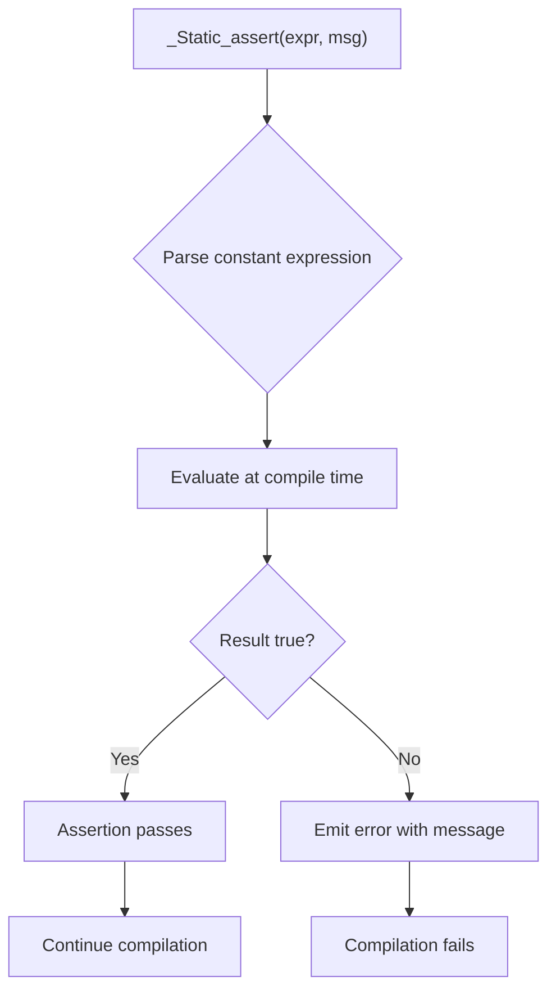

# Lesson 1000: _Static_assert (C11)

## Status: 📋 Planned | Standard: C11 | Effort: Easy

## Objective

Compile-time assertions with optional message.

## Syntax

```c
_Static_assert(constexpr, "message");
_Static_assert(sizeof(int) == 4, "int must be 4 bytes");
```

## C11 Spec

- First argument must be an integer constant expression
- Second argument is a string literal (optional in C23)
- Failure produces a diagnostic message

## Implementation Checklist

- [ ] Parse `_Static_assert(expr, "msg")`
- [ ] Evaluate constant expression at compile time
- [ ] Emit error with message on failure
- [ ] Support in file scope and block scope
- [ ] Test: `_Static_assert(1, "ok");` passes
- [ ] Test: `_Static_assert(0, "fail");` error

## Processing Flow



## Comparison with C23

| Feature | C11 | C23 |
|---------|-----|-----|
| Syntax | `_Static_assert(expr, "msg")` | `static_assert(expr, "msg")` |
| Message required | Yes | No (optional) |
