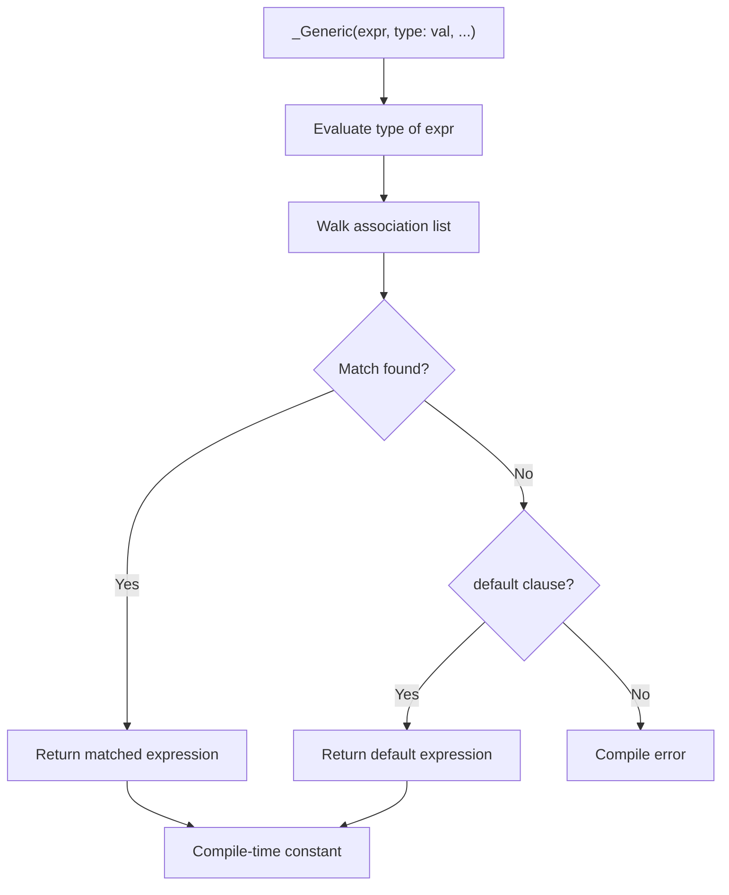

# Lesson 1001: _Generic Selection (C11)

## Status: ✅ Complete | Standard: C11 | Effort: Hard

## Objective

Compile-time type-based dispatch without macros.

## Syntax

```c
_Generic(expr, type1: val1, type2: val2, ..., default: val)
```

## Example

```c
#define type_name(x) _Generic((x), \
    int: "int", \
    float: "float", \
    double: "double", \
    char*: "string", \
    default: "other")
```

## Semantics

1. Evaluate type of controlling expression (without evaluating the expression)
2. Find matching type in association list
3. Return the matched expression (compile-time only, no runtime dispatch)
4. `default` is optional but recommended

## Implementation Checklist

- [ ] Parse `_Generic(expr, type: expr, ...)`
- [ ] Evaluate type of controlling expression
- [ ] Match against association list types
- [ ] Return matched expression as constant
- [ ] Error if no match and no default
- [ ] Support any expression as controlling expression
- [ ] Support any constant expression as result
- [ ] Test: basic type matching
- [ ] Test: default clause
- [ ] Test: error on no match

## Processing Flow



## Use Cases

- Type-generic macros (tgmath.h)
- Type-safe printf wrappers
- Generic logging functions
