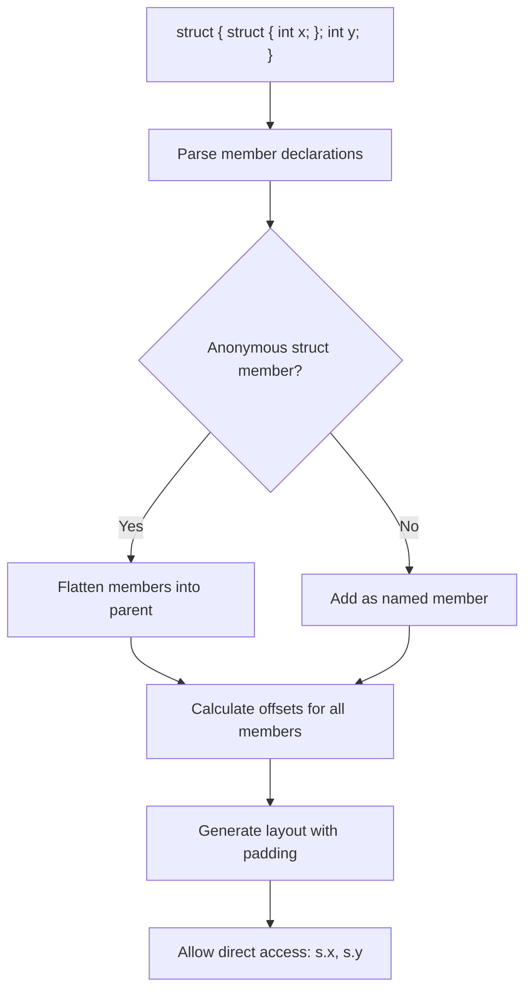

# Lesson 1002: Anonymous Structs (C11)

## Status: ✅ Complete | Standard: C11 | Effort: Medium

## Objective

Embed unnamed structs within structs.

## Syntax

```c
struct Outer {
    struct {          // anonymous struct
        int x;
        int y;
    };                // note: no name
    int z;
};

struct Outer o;
o.x = 10;  // access directly, not o.inner.x
```

## C11 Spec

- Anonymous struct members are "inherited" by containing struct
- Same rules as named members (no name conflicts)
- Can be at any nesting level

## Implementation Checklist

- [ ] Parse unnamed struct/union members
- [ ] Flatten anonymous members into parent struct
- [ ] Calculate offsets correctly
- [ ] Handle name conflicts (error)
- [ ] Support nested anonymous structs
- [ ] Test: `struct { struct { int x; }; int y; } s; s.x = 1;`

## Comparison with Named Structs

```c
// Named
struct Point { int x; int y; };
struct Line { struct Point start; struct Point end; };
l.start.x = 1;

// Anonymous
struct Line2 { struct { int x; int y; } start; struct { int x; int y; } end; };
l2.start.x = 1;

// Anonymous (flattened)
struct Line3 { struct { int x; int y; }; struct { int x; int y; } end; };
l3.x = 1;  // ambiguous! error
```

## Processing Flow


