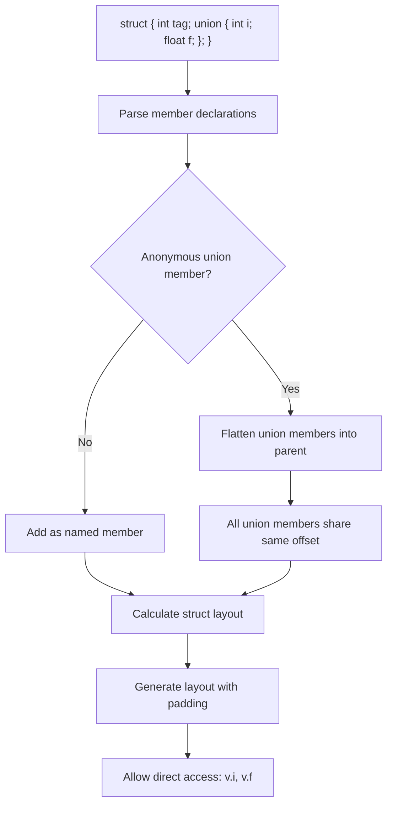

# Lesson 1003: Anonymous Unions (C11)

## Status: 📋 Planned | Standard: C11 | Effort: Medium

## Objective

Embed unnamed unions within structs.

## Syntax

```c
struct Value {
    int type;
    union {          // anonymous union
        int i;
        float f;
        char *s;
    };
};

struct Value v;
v.type = 1;
v.i = 42;  // access directly
```

## Implementation Checklist

- [ ] Parse unnamed union members
- [ ] Flatten anonymous members into parent struct
- [ ] All anonymous union members share same address
- [ ] Handle name conflicts (error)
- [ ] Test: `struct { int t; union { int i; float f; }; } v; v.i = 1;`

## Processing Flow


