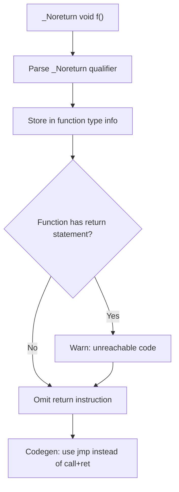

# Lesson 1004: _Noreturn (C11)

## Status: ✅ Complete | Standard: C11 | Effort: Easy

## Objective

Mark functions that never return.

## Syntax

```c
_Noreturn void abort(void);
_Noreturn void exit(int status);
```

## Semantics

- Function does not return to caller
- Calling program must not rely on return value
- Compiler may optimize based on this
- Undefined behavior if function actually returns

## Implementation Checklist

- [ ] Parse `_Noreturn` keyword
- [ ] Store in function type info
- [ ] Warn if function has return statement
- [ ] Warn if return value is used in call
- [ ] Omit return instruction in codegen
- [ ] Test: `_noreturn void die(void) { exit(1); }`

## Comparison with C23

## Processing Flow



## Comparison with C23

| Feature | C11 | C23 |
|---------|-----|-----|
| Syntax | `_Noreturn` | `[[noreturn]]` |
| Attribute syntax | No | Yes |
