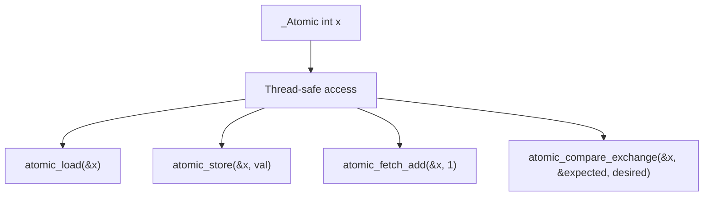

# Lesson 1005: _Atomic (C11)

## Status: 📋 Planned | Standard: C11 | Effort: Hard

## Objective

Atomic operations for thread-safe data access.

## Syntax

```c
_Atomic int counter = 0;
atomic_fetch_add(&counter, 1);
```

## Atomics Overview



## Memory Ordering

| Order | Description |
|-------|-------------|
| `memory_order_relaxed` | No ordering guarantees |
| `memory_order_consume` | Dependencies preserved |
| `memory_order_acquire` | Reads not reordered before |
| `memory_order_release` | Writes not reordered after |
| `memory_order_seq_cst` | Sequential consistency (default) |

## Implementation Checklist

- [ ] Parse `_Atomic` type qualifier
- [ ] Parse `atomic_*` macros/functions
- [ ] Generate lock prefix (`lock`) for x86 atomic ops
- [ ] Implement `atomic_load`, `atomic_store`
- [ ] Implement `atomic_fetch_add`, `atomic_fetch_sub`
- [ ] Implement `atomic_compare_exchange_strong`
- [ ] Memory barrier instructions
- [ ] Test: atomic increment from multiple threads

## x86-64 Atomic Instructions

| Instruction | Operation |
|-------------|-----------|
| `lock xadd` | Atomic fetch-and-add |
| `lock cmpxchg` | Atomic compare-and-swap |
| `mfence` | Full memory fence |
| `lfence` | Load fence |
| `sfence` | Store fence |
