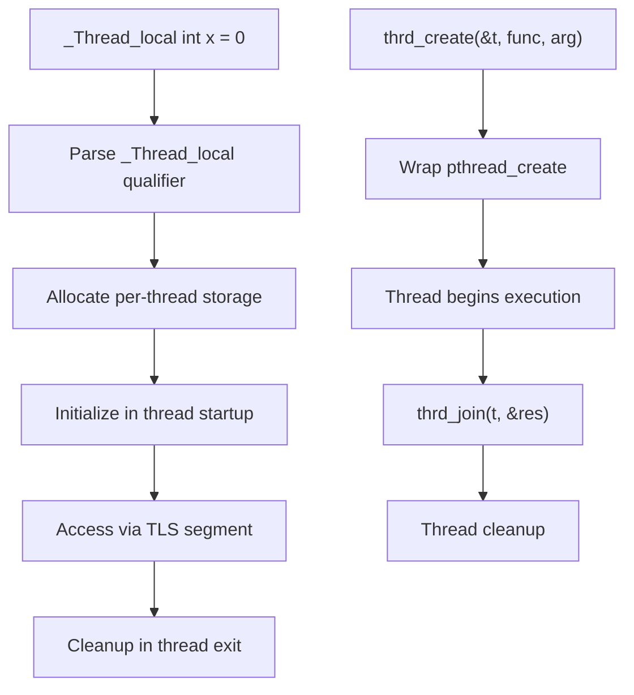

# Lesson 1006: Threads (C11)

## Status: ✅ Complete | Standard: C11 | Effort: Hard

## Objective

Thread creation, joining, and synchronization.

## API

```c
#include <threads.h>

thrd_t thread;
thrd_create(&thread, func, arg);
thrd_join(thread, &result);
thrd_detach(thread);

mtx_t mutex;
mtx_init(&mutex, mtx_plain);
mtx_lock(&mutex);
mtx_unlock(&mutex);
mtx_destroy(&mutex);

cnd_t cond;
cnd_init(&cond);
cnd_wait(&cond, &mutex);
cnd_signal(&cond);
cnd_broadcast(&cond);
cnd_destroy(&cond);
```

## Implementation

Typically wraps POSIX threads (pthreads) or Win32 threads.

## Implementation Checklist

- [ ] Implement `thrd_create` (wraps pthread_create)
- [ ] Implement `thrd_join` (wraps pthread_join)
- [ ] Implement `thrd_detach` (wraps pthread_detach)
- [ ] Implement `mtx_init/lock/unlock/destroy`
- [ ] Implement `cnd_init/wait/signal/broadcast/destroy`
- [ ] Implement `call_once` (wraps pthread_once)
- [ ] Thread-local storage (`tss_*`)
- [ ] Test: producer-consumer with mutex and condition variable

## Processing Flow


