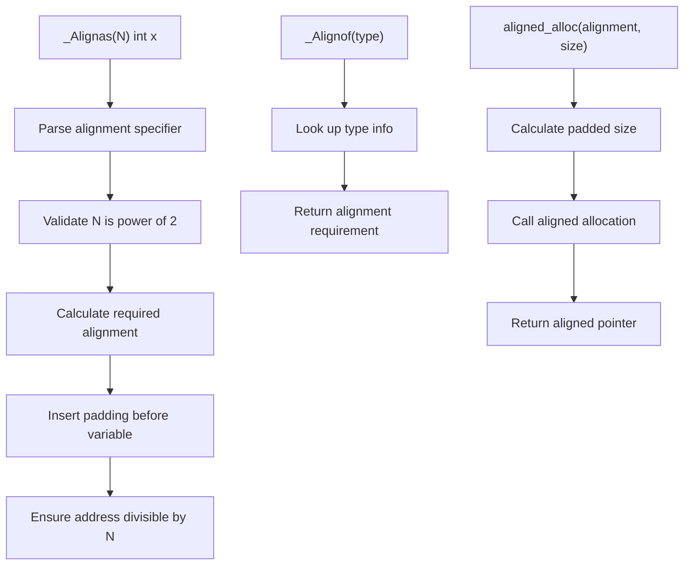

# Lesson 1007: _Alignas and _Alignof (C11)

## Status: ✅ Complete | Standard: C11 | Effort: Easy

## Objective

Control data alignment.

## Syntax

```c
_Alignas(16) char buffer[256];  // aligned to 16 bytes
_Alignof(int)                    // returns alignment requirement of int
```

## Common Alignments

| Type | Alignment |
|------|-----------|
| char | 1 |
| short | 2 |
| int | 4 |
| long | 8 |
| pointer | 8 |
| SIMD types | 16, 32 |

## Implementation Checklist

- [ ] Parse `_Alignas(N)` in declarations
- [ ] Parse `_Alignof(type)` expression
- [ ] Calculate alignment requirements for all types
- [ ] Insert padding for alignment in structs
- [ ] Align stack frame to required boundary
- [ ] Align global variables
- [ ] Test: `_Alignas(16) int x;` has address divisible by 16
- [ ] Test: `_Alignof(long long)` → 8

## Processing Flow


