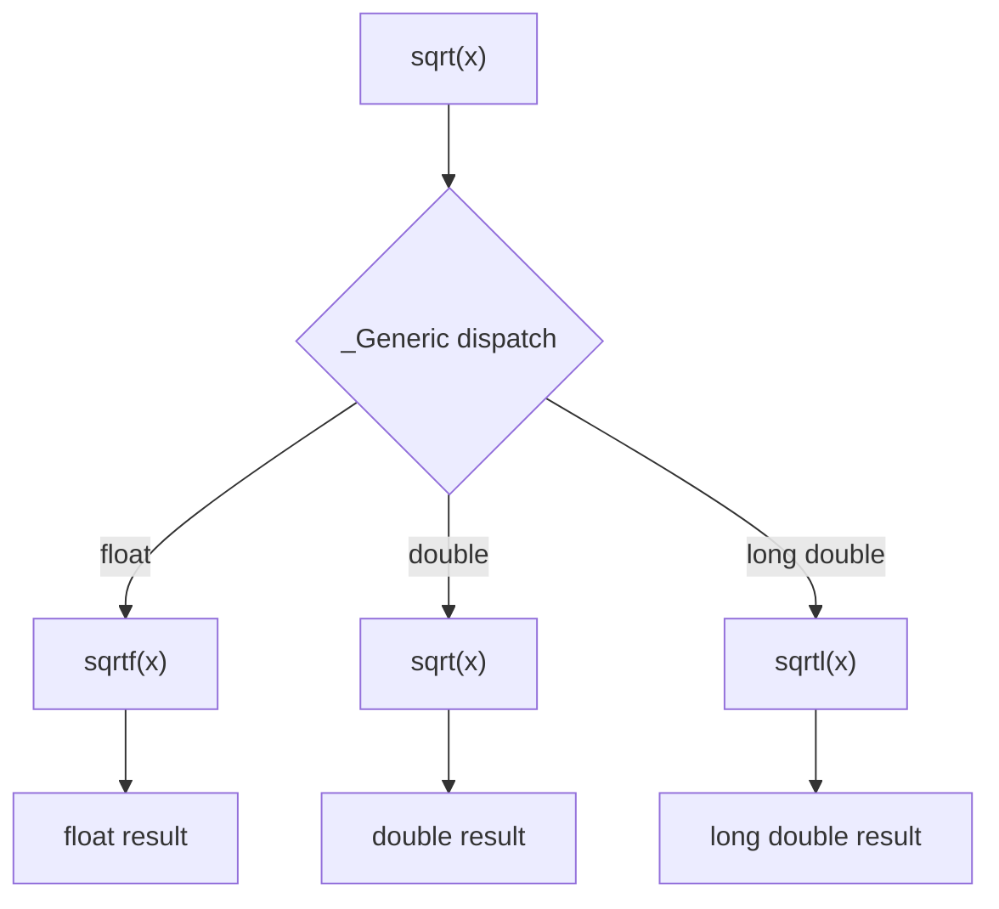

# Lesson 1008: <tgmath.h> (Type-Generic Math)

## Status: ✅ Complete | Standard: C11 | Effort: Medium

## Objective

Type-generic math macros using `_Generic`.

## Example

```c
#include <tgmath.h>

double d = sqrt(3.14);      // calls sqrt(double)
float f = sqrtf(3.14f);     // calls sqrtf(float)
long double ld = sqrtl(3.14L); // calls sqrtl(long double)

// Generic macro dispatches based on argument type
#define sqrt(x) _Generic((x), \
    float: sqrtf, \
    double: sqrt, \
    long double: sqrtl \
)(x)
```

## Functions in tgmath.h

| Category | Functions |
|----------|-----------|
| Basic math | `ceil`, `floor`, `round`, `trunc`, `fabs` |
| Power | `pow`, `sqrt`, `cbrt`, `hypot` |
| Trigonometric | `sin`, `cos`, `tan`, `asin`, `acos`, `atan` |
| Hyperbolic | `sinh`, `cosh`, `tanh` |
| Logarithmic | `log`, `log2`, `log10`, `exp` |

## Type-Generic Dispatch Flow



## Implementation Checklist

- [ ] Define type-generic macros for math functions
- [ ] Use `_Generic` to dispatch to correct version
- [ ] Support float, double, long double variants
- [ ] Complex number support (optional)
- [ ] Test: `sqrt(4.0)` returns double, `sqrtf(4.0f)` returns float
