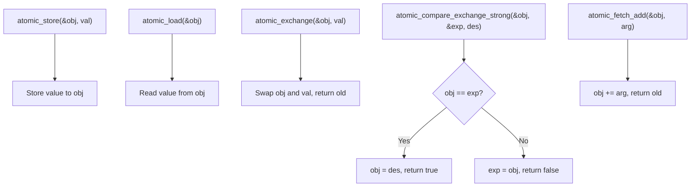

# Lesson 1009: <stdatomic.h> (C11)

## Status: ✅ Complete | Standard: C11 | Effort: Medium

## Objective

Standard atomic types and operations.

## Types

```c
atomic_bool
atomic_char
atomic_int
atomic_long
atomic_size_t
atomic_uintptr_t
atomic_ptrdiff_t
```

## Operations

| Function | Description |
|----------|-------------|
| `atomic_init(obj, value)` | Initialize atomic |
| `atomic_store(obj, value)` | Store value |
| `atomic_load(obj)` | Load value |
| `atomic_exchange(obj, value)` | Swap values |
| `atomic_compare_exchange_weak(obj, expected, desired)` | CAS (weak) |
| `atomic_compare_exchange_strong(obj, expected, desired)` | CAS (strong) |
| `atomic_fetch_add(obj, arg)` | Add and return old |
| `atomic_fetch_sub(obj, arg)` | Subtract and return old |
| `atomic_fetch_or(obj, arg)` | Bitwise OR |
| `atomic_fetch_and(obj, arg)` | Bitwise AND |
| `atomic_fetch_xor(obj, arg)` | Bitwise XOR |

## Atomic Operation Flow



## Implementation Checklist

- [ ] Define `atomic_*` types (wrap underlying type)
- [ ] Implement `atomic_store` / `atomic_load`
- [ ] Implement `atomic_compare_exchange`
- [ ] Implement `atomic_fetch_*` operations
- [ ] Memory fence instructions
- [ ] `atomic_thread_fence` function
- [ ] Test: lock-free counter
