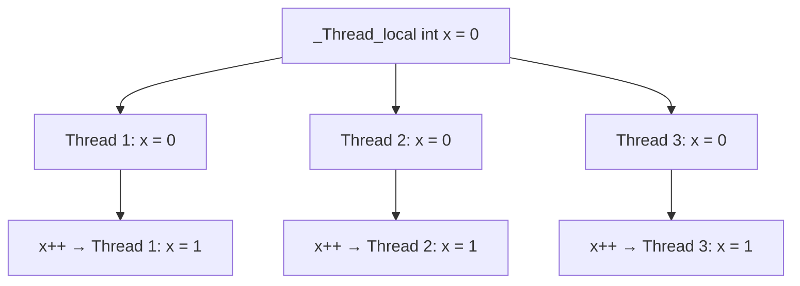

# Lesson 1010: _Thread_local (C11)

## Status: ✅ Complete | Standard: C11 | Effort: Medium

## Objective

Thread-local storage for per-thread data.

## Syntax

```c
_thread_local int counter = 0;  // each thread has its own copy
__thread int tls_var;           // GCC extension (same)
```

## Semantics



## Implementation

- On Linux: uses `__thread` GCC extension or `thread_local` (C23)
- Storage in TLS segment of ELF
- Accessed via FS/GS segment register offset

## Implementation Checklist

- [ ] Parse `_Thread_local` keyword
- [ ] Allocate in TLS segment (.tdata/.tbss)
- [ ] Access via FS-relative addressing
- [ ] Initialize per-thread on thread creation
- [ ] Destroy on thread exit
- [ ] Test: increment counter in 3 threads, verify isolation
