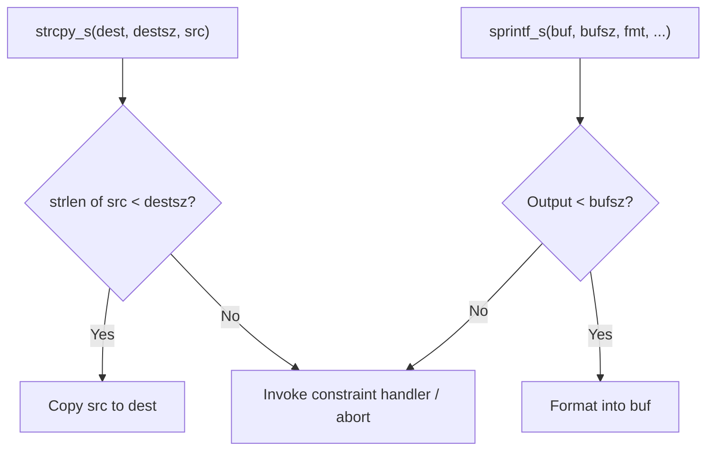

# Lesson 1011: Bounds Checking (C11 Annex K)

## Status: 📋 Planned | Standard: C11 (Annex K) | Effort: Medium

## Objective

Secure versions of string/memory functions with bounds checking.

## Functions

| Secure Function | Replaces |
|-----------------|----------|
| `strcpy_s(dest, destsz, src)` | `strcpy` |
| `strncpy_s(dest, destsz, src, count)` | `strncpy` |
| `strcat_s(dest, destsz, src)` | `strcat` |
| `sprintf_s(buf, bufsz, fmt, ...)` | `sprintf` |
| `scanf_s(fmt, ...)` | `scanf` |
| `fopen_s(pFile, filename, mode)` | `fopen` |

## Bounds Checking Flow

## Implementation Checklist

- [ ] Implement `strcpy_s` with bounds check
- [ ] Implement `strncpy_s` with null termination
- [ ] Implement `sprintf_s` with buffer size
- [ ] Invoke constraint handler on error (or abort)
- [ ] Test: buffer overflow prevented by bounds check
