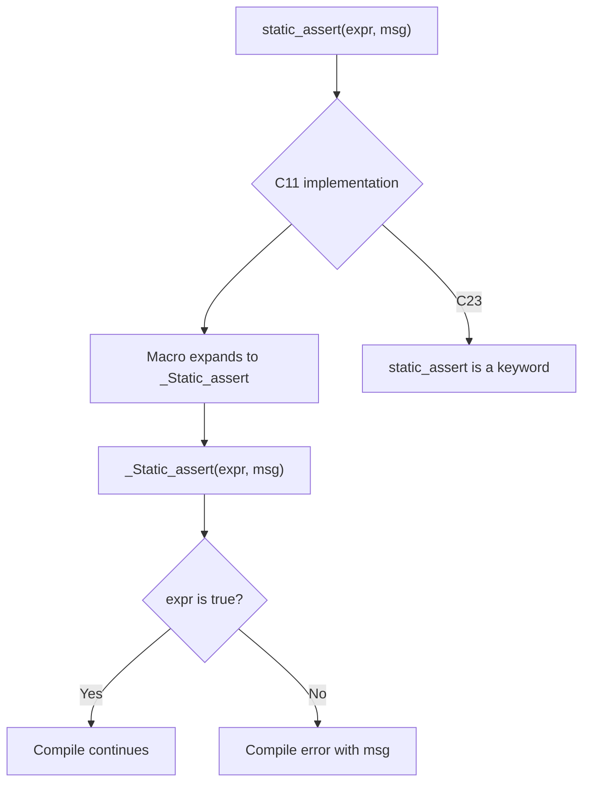

# Lesson 1012: static_assert (C11 Optional)

## Status: ✅ Complete | Standard: C11 | Effort: Easy

## Objective

Alias for `_Static_assert` via `<assert.h>`.

## Static Assert Alias Flow

## Notes

- `<assert.h>` may define `static_assert` as macro
- C11 requires `_Static_assert` as keyword
- C23 makes `static_assert` a keyword
