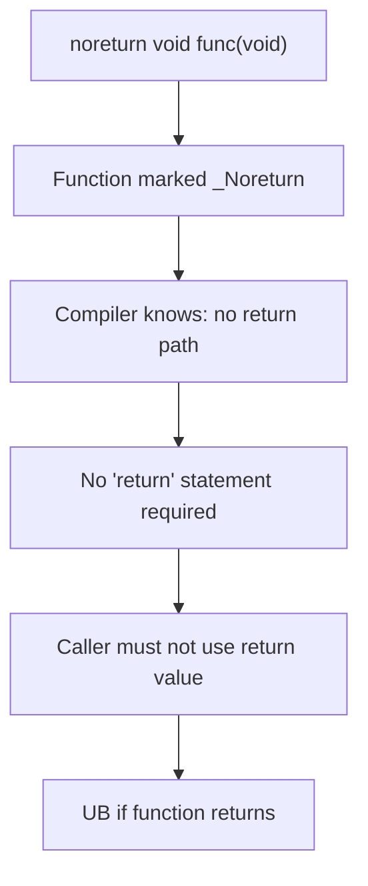

# Lesson 1013: Header `<stdnoreturn.h>` (C11)

## Status: 📋 Planned | Standard: C11 | Effort: Trivial

## Objective

Provide `noreturn` macro for `_Noreturn`.

## Usage

```c
#include <stdnoreturn.h>

noreturn void abort(void);
noreturn void exit(int status);
```

## Noreturn Function Flow



## Implementation

- Define `noreturn` as `_Noreturn`
- Simple macro in header
