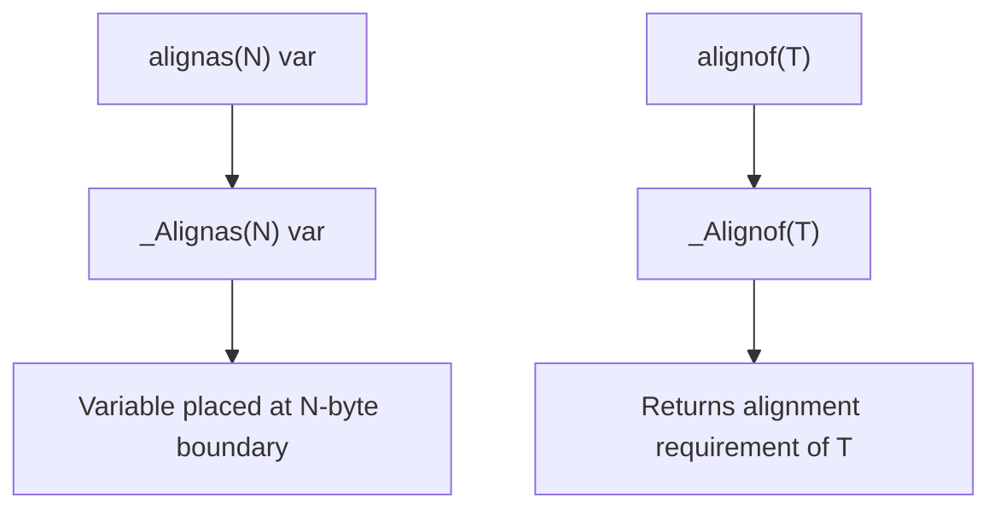

# Lesson 1014: Header `<stdalign.h>` (C11)

## Status: ✅ Complete | Standard: C11 | Effort: Trivial

## Objective

Provide `alignas` and `alignof` macros.

## Usage

```c
#include <stdalign.h>

alignas(16) char buffer[256];
size_t a = alignof(int);  // typically 4
```

## Alignment Macro Flow



## Implementation

- `alignas(N)` → `_Alignas(N)`
- `alignof(T)` → `_Alignof(T)`
