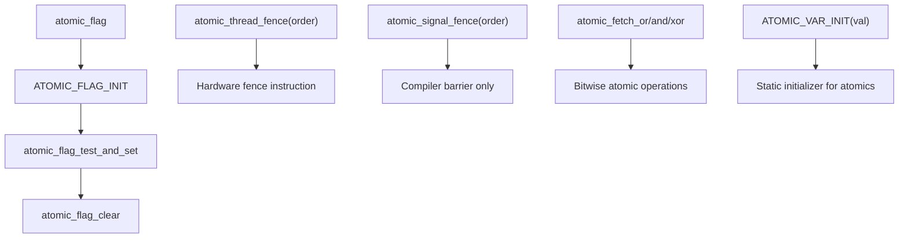

# Lesson 1015: Header `<stdatomic.h>` Complete (C11)

## Status: 📋 Planned | Standard: C11 | Effort: Medium

## Objective

Complete atomic types and operations header.

## Complete stdatomic Flow

## Includes

- `atomic_bool`, `atomic_int`, `atomic_long`, etc.
- `ATOMIC_*_INIT` macros
- `atomic_flag` (lock-free boolean)
- `atomic_init` function
- `atomic_thread_fence`, `atomic_signal_fence`
