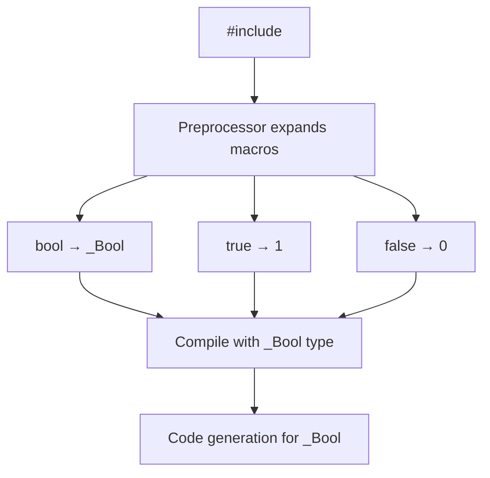

# Lesson 2000: stdbool.h (C17)

## Status: ✅ Complete | Standard: C17 | Effort: Trivial

## Objective

Provide `bool`, `true`, `false` macros via header.

## C17 Notes

- No changes from C11
- `<stdbool.h>` provides: `bool`, `true`, `false`
- Maps to `_Bool`, `1`, `0`

## Implementation

- Header defines: `#define bool _Bool`
- Header defines: `#define true 1`
- Header defines: `#define false 0`

## Processing Flow

