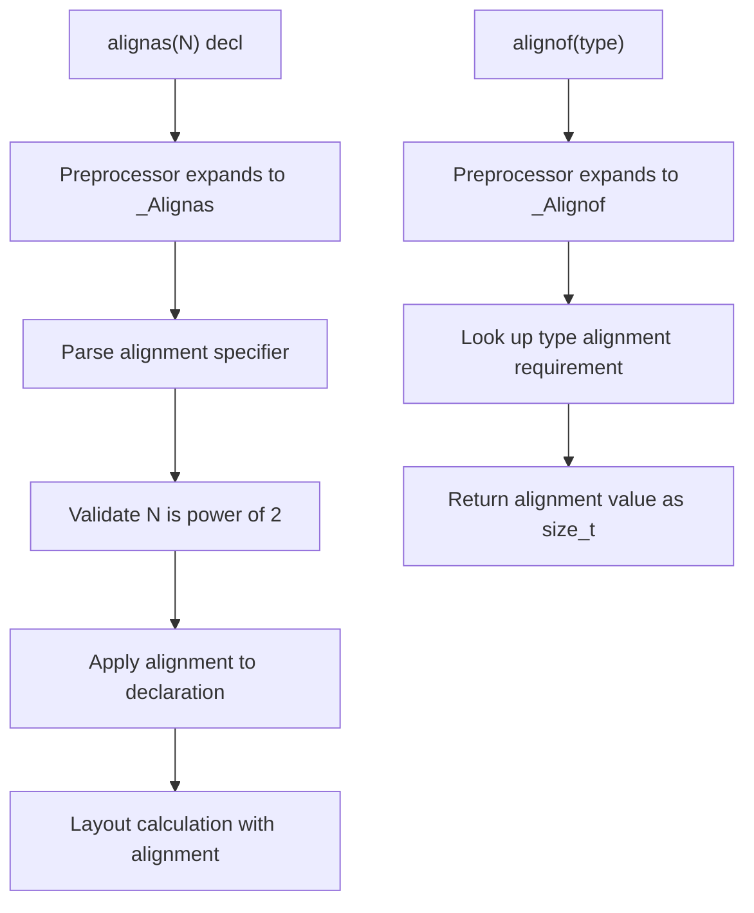

# Lesson 2001: stdalign.h (C17)

## Status: ✅ Complete | Standard: C17 | Effort: Trivial

## Objective

Provide `alignas` and `alignof` macros.

## C17 Notes

- No changes from C11
- `<stdalign.h>` provides: `alignas`, `alignof`
- Maps to `_Alignas`, `_Alignof`

## Implementation

- Header defines: `#define alignas _Alignas`
- Header defines: `#define alignof _Alignof`

## Processing Flow

