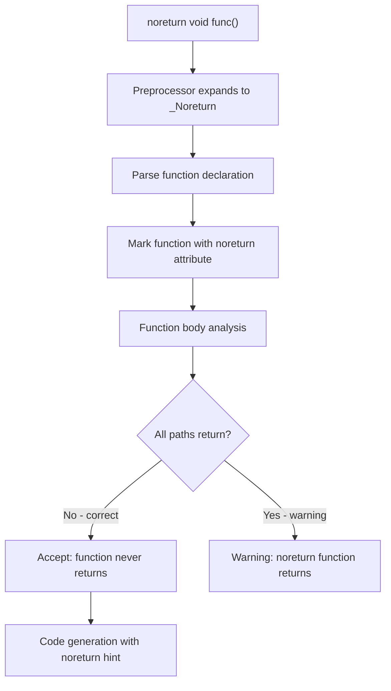

# Lesson 2002: stdnoreturn.h (C17)

## Status: 📋 Planned | Standard: C17 | Effort: Trivial

## Objective

Provide `noreturn` macro.

## C17 Notes

- No changes from C11
- `<stdnoreturn.h>` provides: `noreturn`
- Maps to `_Noreturn`

## Implementation

- Header defines: `#define noreturn _Noreturn`

## Processing Flow

