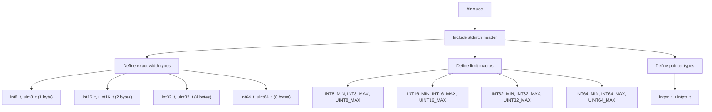

# Lesson 2003: stdint.h (C17)

## Status: 📋 Planned | Standard: C17 | Effort: Easy

## Objective

Exact-width integer types.

## Types

| Type | Size |
|------|------|
| `int8_t`, `uint8_t` | 1 byte |
| `int16_t`, `uint16_t` | 2 bytes |
| `int32_t`, `uint32_t` | 4 bytes |
| `int64_t`, `uint64_t` | 8 bytes |
| `intptr_t`, `uintptr_t` | pointer size |
| `intmax_t`, `uintmax_t` | max width |

## Macros

- `INT8_MIN`, `INT8_MAX`, `UINT8_MAX`
- `INT16_MIN`, `INT16_MAX`, `UINT16_MAX`
- `INT32_MIN`, `INT32_MAX`, `UINT32_MAX`
- `INT64_MIN`, `INT64_MAX`, `UINT64_MAX`
- `SIZE_MAX`, `PTRDIFF_MIN`, `PTRDIFF_MAX`

## Implementation Checklist

- [ ] Define exact-width types
- [ ] Define limit macros
- [ ] Define `intN_t`, `uintN_t` for N = 8, 16, 32, 64
- [ ] Test: `sizeof(int32_t)` → 4
- [ ] Test: `INT32_MAX` → 2147483647

## Processing Flow

