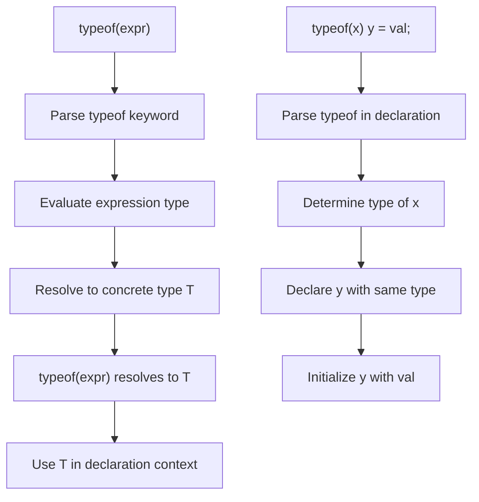

# Lesson 2004: typeof (C17)

## Status: 📋 Planned | Standard: C17 | Effort: Easy

## Objective

GCC extension `typeof` (standardized in C23).

## Notes

- C17 doesn't standardize `typeof`
- This lesson covers GCC extension support
- C23 makes it official

## Implementation

- Parse `typeof(expr)` as type specifier
- Use in variable declarations

## Processing Flow

