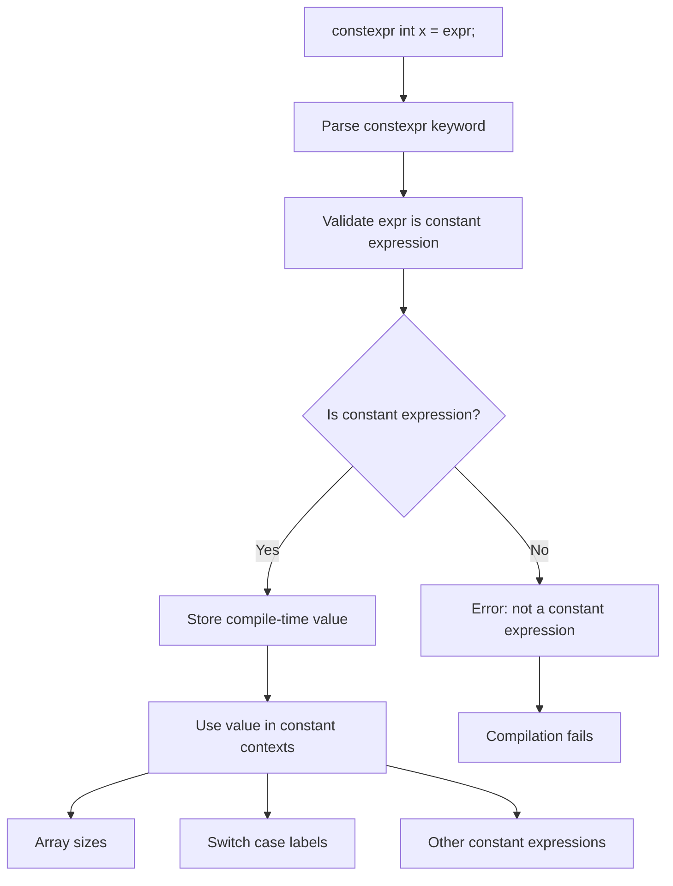

# Lesson 2005: constexpr (C17 GCC Extension)

## Status: 📋 Planned | Standard: C17 (GCC extension) | Effort: Easy

## Objective

Compile-time constant expressions (GCC extension, standardized in C23).

## Notes

- C17 doesn't standardize `constexpr`
- GCC/Clang support `__attribute__((const))` and similar
- C23 makes `constexpr` official

## Implementation

- Parse `constexpr` as keyword (GCC mode)
- Validate constant expressions
- Use in array sizes and switch cases

## Processing Flow

