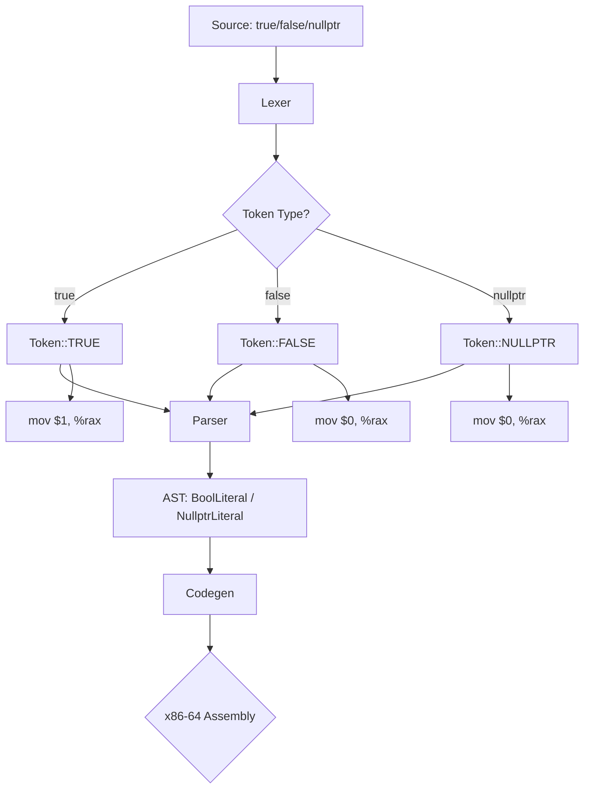

# Lesson 3000: bool, true, false (C23)

## Status: ✅ Complete | Standard: C23 | Effort: Easy

## Objective

Native `bool`, `true`, `false` keywords.

## Changes from C11

```c
// C11: requires <stdbool.h>
#include <stdbool.h>

// C23: native keywords
bool flag = true;
```

## Implementation Checklist

- [ ] Add `bool`, `true`, `false` as keywords
- [ ] `_Bool` still available for compatibility
- [ ] Test: `bool x = true; return x;` → 1

## Flow Diagram


