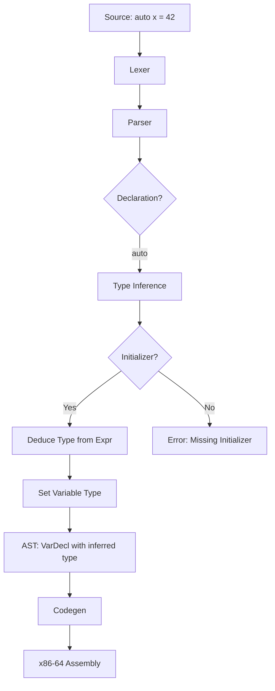

# Lesson 3001: auto Type Inference (C23)

## Status: 📋 Planned | Standard: C23 | Effort: Easy

## Objective

Infer variable type from initializer.

## Syntax

```c
auto x = 42;        // int
auto y = 3.14;      // double
auto *p = &x;       // int*
auto arr[3] = {1,2,3}; // int[3] (C23)
```

## C++ Comparison

```cpp
// C++11
auto x = 42;        // int
auto& r = x;        // int&
auto* p = &x;       // int*

// C23 - similar but more limited
auto x = 42;        // int
auto *p = &x;       // int*
// No auto& or auto&&
```

## Implementation Checklist

- [ ] Parse `auto` as type specifier
- [ ] Infer type from initializer expression
- [ ] Error if initializer is void or incomplete type
- [ ] Support `auto` in local variables only (not global)
- [ ] Test: `auto x = 42;` → x is int
- [ ] Test: `auto p = &x;` → p is pointer
- [ ] Test: error on `auto y;` (no initializer)

## Flow Diagram


