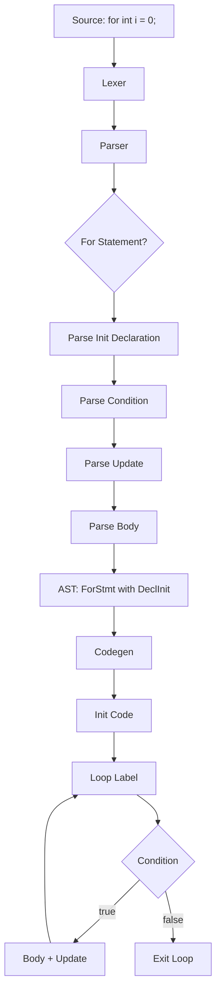

# Lesson 3002: For-Loop Init Declarations (C23)

## Status: 📋 Planned | Standard: C23 | Effort: Easy

## Objective

Allow variable declaration in for-loop initializer without C99 restriction.

## Syntax

```c
// C99: requires type
for (int i = 0; i < 10; i++) { }

// C23: allows any declaration
for (auto i = 0; i < 10; i++) { }
for (int i = 0, j = 10; i < j; i++, j--) { }
```

## Changes from C99

- C99: only `for (type var = init; ...; ...)`
- C23: allows `for (decl; ...; ...)` where decl is any declaration
- Scoped to for-loop body only

## Implementation Checklist

- [ ] Allow any declaration in for-loop init
- [ ] Variable scope limited to for-loop
- [ ] Support multiple declarations: `for (int i = 0, j = 10; ...)`
- [ ] Support `auto` in for-loop init
- [ ] Test: `for (auto i = 0; i < 5; i++) { }`
- [ ] Test: variable not accessible after loop

## Flow Diagram


