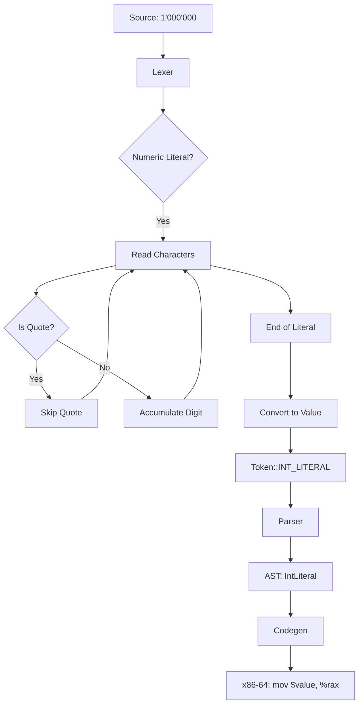

# Lesson 3004: Digit Separators (C23)

## Status: 📋 Planned | Standard: C23 | Effort: Easy

## Objective

Allow single quotes in numeric literals for readability.

## Syntax

```c
int million = 1'000'000;
long long large = 123'456'789'ABC;
float pi = 3.141'592'653;
unsigned hex = 0xFF'FF'FF'FF;
unsigned bin = 0b1010'0101;
```

## Rules

- Single quote can appear between digits
- Cannot start or end with quote
- Cannot have two consecutive quotes
- Works in all numeric literals (decimal, hex, binary, float)

## Implementation Checklist

- [ ] Lexer: skip `'` in numeric literals
- [ ] Strip quotes before converting to value
- [ ] Support in integer literals (decimal, hex, binary)
- [ ] Support in float literals
- [ ] Test: `int x = 1'000;` → 1000
- [ ] Test: `int h = 0xFF'FF;` → 65535
- [ ] Test: error on `1'` (trailing quote)

## Flow Diagram


