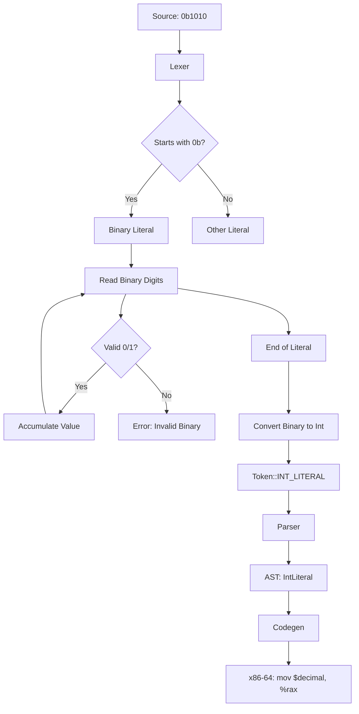

# Lesson 3005: Binary Literals (C23)

## Status: 📋 Planned | Standard: C23 | Effort: Easy

## Objective

Binary integer literal syntax.

## Syntax

```c
int flags = 0b1010'0101;
unsigned mask = 0b1111'0000;
char bits = 0b1;
```

## History

- GCC extension: `0b1010` (available in C mode)
- C23: officially standardized

## Implementation Checklist

- [ ] Lexer: parse `0b` prefix for binary literals
- [ ] Parse binary digits (0 and 1)
- [ ] Support digit separators: `0b1010'0101`
- [ ] Convert to integer value
- [ ] Test: `int x = 0b1010;` → 10
- [ ] Test: `int y = 0b1111'0000;` → 240
- [ ] Test: error on `0b` with no digits

## Flow Diagram


