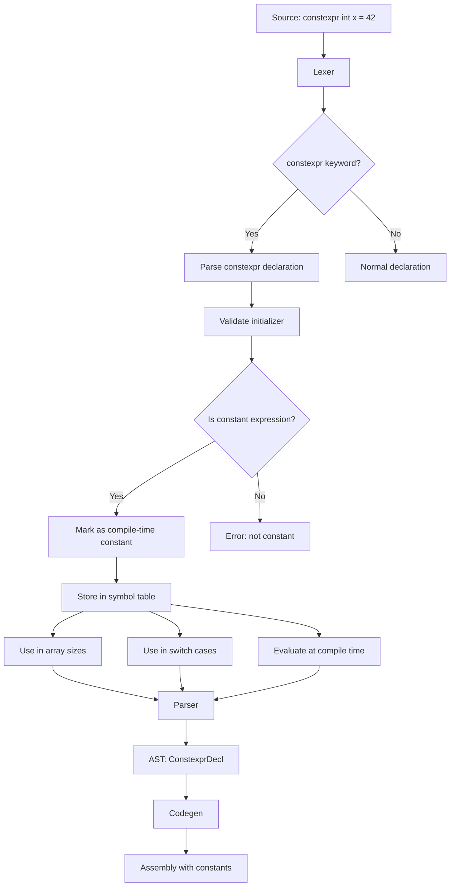

# Lesson 3008: constexpr (C23)

## Status: ✅ Complete | Standard: C23 | Effort: Medium

## Objective

Compile-time constant expressions.

## Syntax

```c
constexpr int size = 10;
constexpr int arr[size] = {0};
constexpr int square(int x) { return x * x; }
```

## Implementation Checklist

- [ ] Parse `constexpr` keyword
- [ ] Validate initializer is constant expression
- [ ] Use in array sizes and switch cases
- [ ] Support constexpr functions
- [ ] Test: `constexpr int x = 42;` → compile-time constant

## Flow Diagram


