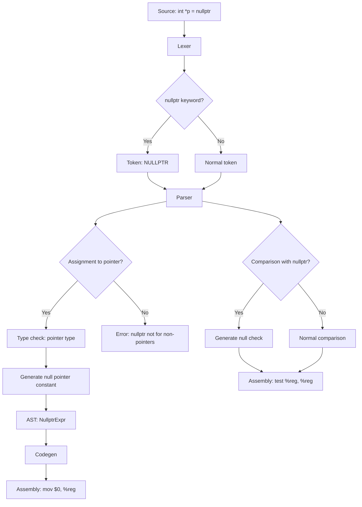

# Lesson 3009: nullptr (C23)

## Status: ✅ Complete | Standard: C23 | Effort: Easy

## Objective

Null pointer constant keyword.

## Syntax

```c
int *p = nullptr;      // instead of NULL or 0
if (p == nullptr) { }  // explicit null check
```

## C23 vs C11

| Feature | C11 | C23 |
|---------|-----|-----|
| Null pointer | `NULL` (macro) | `nullptr` (keyword) |
| Type safety | Weak | Strong |
| Usable in `_Generic` | No | Yes |

## Implementation Checklist

- [ ] Add `nullptr` keyword
- [ ] `nullptr` has type `void*` (or dedicated null pointer type)
- [ ] `nullptr == ptr` comparisons
- [ ] `if (ptr)` still works
- [ ] Test: `int *p = nullptr; return p == nullptr;` → 1

## Flow Diagram


