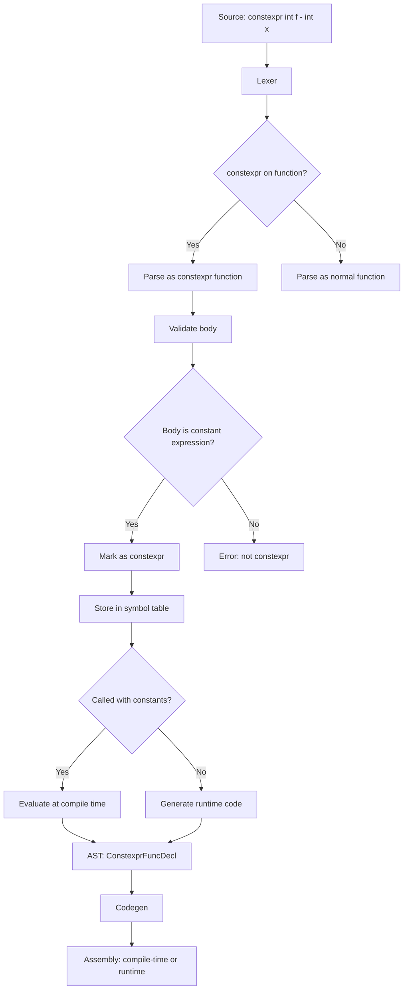

# Lesson 3010: constexpr Functions (C23)

## Status: 📋 Planned | Standard: C23 | Effort: Medium

## Objective

Functions evaluable at compile time.

## Syntax

```c
constexpr int factorial(int n) {
    if (n <= 1) return 1;
    return n * factorial(n - 1);
}

constexpr int fact10 = factorial(10);  // computed at compile time
```

## Rules

- Body must be single return statement (C23 initial)
- All expressions must be constant expressions
- No static/local variables
- No pointer arguments (C23 relaxation may come later)

## Implementation Checklist

- [ ] Parse `constexpr` on functions
- [ ] Validate function body is constant expression
- [ ] Evaluate at compile time when called with constants
- [ ] Fall back to runtime if args not constant
- [ ] Test: `constexpr int f(int x) { return x * 2; }`

## Flow Diagram


