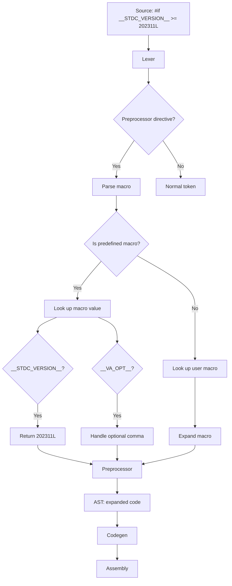

# Lesson 3014: Predefined Macros (C23)

## Status: 📋 Planned | Standard: C23 | Effort: Easy

## Objective

Additional predefined macros.

## New Macros in C23

| Macro | Description |
|-------|-------------|
| `__STDC_VERSION__` | `202311L` for C23 |
| `__VA_OPT__(,)` | Optional comma in variadic macros |
| `__cplusplus` | C++ compatibility (if applicable) |

## Standard Macros (all versions)

| Macro | Description |
|-------|-------------|
| `__FILE__` | Current filename |
| `__LINE__` | Current line number |
| `__DATE__` | Compilation date |
| `__TIME__` | Compilation time |
| `__STDC__` | Conforming implementation |
| `__STDC_HOSTED__` | Hosted implementation |

## Implementation Checklist

- [ ] Define `__STDC_VERSION__` as `202311L`
- [ ] Implement `__VA_OPT__(,)` for variadic macros
- [ ] Ensure all standard macros are defined
- [ ] Test: `#if __STDC_VERSION__ >= 202311L`

## Flow Diagram

